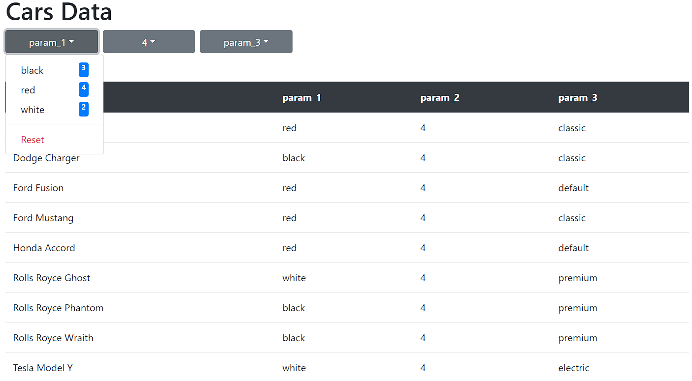

# Car dealer website
A simple project of a website that could be used for selling cars (or whatever else data is inside the database). I tested it on Raspberry PI 4.


Website is created dynamically and size of the table and number of dropdown buttons and elements inside of them depends on amount of data and amount of columns in database. User can filter values in each parameter by using the dropdown buttons and selecting value they want. Each filter cuts amount of data in the table but also number of elements inside the dropdown lists (both are fetched from apis that get response from database after every choice that user make).

## Database
I created a simple PostgreSQL Database with some random cars and their 3 parameters: color, number of seats and class.

To import the database type in command line:
```
psql -U username dbname < dbexport.pgsql
```
Make sure that your PostgreSQL is using port 5432 (it's default one - if not than you have to change configuration in server's connection). I also recommend creating another user for database that has only privileges to use SELECT from table - just to make it more secure.

## Server

Inside of project directory I made 2 directories: server and frontend. It's important to know because there is script that starts both and it's using such path.

For server I used Node.js and configured it as listed below (all commands used inside server directory):

```commandline
npm init -y
```
```
npm install concurrently cors express pg body-parser
```
```
npm install concurrently cors express pg body-parser
```
```
npm install concurrently --save-dev nodemon
```

## Frontend

For frontend I used React.js and configured it as shown below (used inside project's main directory):
```
npm init react-app ./frontend
```

## Running both server and client
To run both server and client it is enough to run this command inside server directory:
```commandline
npm run both
```
If there are any problems you can try using ``--verbose`` flag at the end.

It is not solution for a real website, but for me, who was trying to just make some tests, it was enough. I was impressed because time to build the website was around 70-100 ms and api fetching took around 15-40 ms.